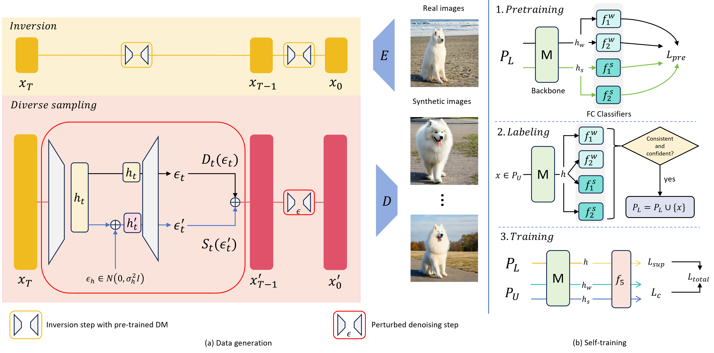

# DreamDA
This is the official repository for [DreamDA: Generative Data Augmentation with Diffusion Models](https://arxiv.org/pdf/2403.12803.pdf). We will release the full code soon.

## Introduction
**DreamDA** generates synthetic images for dataset expansion and present a self-training approach to effectively learn from synthetic images.  To generate diverse synthetic images that adhere to the target training data distribution, each image in the target training dataset is treated as a seed, and Diverse variations of the seed images are generated by:
1. inverting the diffusion latent of the seed image $\`x_0\`$ to $\`x_T\`$ using a pre-trained diffusion model
2. adding Gaussian noise to the U-Net bottleneck feature of the diffusion model for every step of the reverse diffusion process initialized with the inverted diffusion latent


## Requirements
The requirements can be install using conda and our *environment.yml* file:
```
conda env create -f environment.yml
```
Note that accelerate need to be configured with
```
accelerate config
```

## Data Preparation
Datasets can be dowloaded with the following links:
- [Caltech101](https://drive.google.com/file/d/1oqrf9-UmKaOBkK86c-0OAxLwkPNlCPWg/view?usp=sharing)
- [Stanford Cars](https://drive.google.com/file/d/1YJ5JuVaWOqVLtfID-SglbL9Y7_lrh67w/view)
- [Oxford-IIIT Pets](https://drive.google.com/file/d/17yfP7c7bLnN97fC-eWP2W9j3e6HEuL7H/view?usp=sharing)
- [ImageNet-1k](https://www.image-net.org/download.php)
- [ShenzhenTB](https://data.lhncbc.nlm.nih.gov/public/Tuberculosis-Chest-X-ray-Datasets/Shenzhen-Hospital-CXR-Set/index.html)
- [STL-10](https://cs.stanford.edu/~acoates/stl10/)

Note that you can extract ImageNet using this [script](https://gist.github.com/BIGBALLON/8a71d225eff18d88e469e6ea9b39cef4).

## Generating synthetic images
We leverage [CycleDiffusion](https://arxiv.org/pdf/2210.05559) as our inversion pipeline.  For example, to generate synthetic images for the Oxford-IIIT Pets, run
```
cd latent_perturbation
bash generate_synthetic_data.sh
```

## Training with synthetic and real data
In the paper, we train our model using a combined set of synthetic data and the original real data. Before training, curate the combined training dataset by updating paths in  `cp_real.py` accordingly and run:
```
python cp_real.py
```
We provide scripts to train with the combined datasets. For example, `train_noAMST.sh` train a ResNet50 without using AMST. This assumes that the synthetic images have the same label as the seed image.
```
bash train_noAMST.sh
```
We will release the scripts for AMST soon.

## Citation
If you find this project useful for your research, please consider citing:
```
@article{fu2024dreamda,
  title={DreamDA: Generative Data Augmentation with Diffusion Models},
  author={Fu, Yunxiang and Chen, Chaoqi and Qiao, Yu and Yu, Yizhou},
  journal={arXiv preprint arXiv:2403.12803},
  year={2024}
}
```

## Acknowledgements
Our implementation is mainly based on [pytorch-image-models](https://github.com/huggingface/pytorch-image-models) and [CycleDiffusion](https://github.com/ChenWu98/cycle-diffusion). We gratefully thank the authors for their wonderful works.